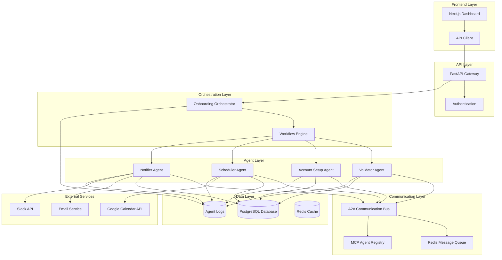

# KRNL Onboarding System - Design Document

## Table of Contents
1. [System Overview](#system-overview)
2. [Architecture Diagram](#architecture-diagram)
3. [Agent Communication](#agent-communication)
4. [MCP/A2A Implementation Details](#mcpa2a-implementation-details)
5. [Production Scaling Considerations](#production-scaling-considerations)

---

## System Overview

The KRNL Onboarding System is a **multi-agent distributed system** designed to automate employee onboarding workflows. The system orchestrates four specialized agents that work collaboratively to process new employee data, validate information, set up accounts, schedule meetings, and send notifications.

### Key Features
- **Multi-Agent Architecture**: Four specialized agents (Validator, Account Setup, Scheduler, Notifier)
- **Agent-to-Agent Communication**: Direct communication between agents using A2A protocols
- **MCP Compliance**: Multi-Cloud Protocol implementation with standardized manifests
- **Real-time Dashboard**: Next.js frontend for monitoring and management
- **Comprehensive Logging**: Structured logging with full audit trails
- **Containerized Deployment**: Docker-based architecture with Redis message bus

---

## Architecture Diagram



### Component Descriptions

**Frontend Layer:**
- **Next.js Dashboard**: React-based admin interface for managing onboarding workflows
- **API Client**: HTTP client for communicating with backend services

**API Layer:**
- **FastAPI Gateway**: RESTful API gateway handling HTTP requests
- **Authentication**: Bearer token-based authentication system

**Orchestration Layer:**
- **Onboarding Orchestrator**: Central coordinator managing workflow execution
- **Workflow Engine**: State machine managing agent execution sequence

**Agent Layer:**
- **Validator Agent**: Validates and cleans employee data
- **Account Setup Agent**: Creates system accounts and assigns permissions
- **Scheduler Agent**: Creates calendar events for onboarding activities
- **Notifier Agent**: Sends notifications via email/Slack

**Communication Layer:**
- **A2A Communication Bus**: Message bus enabling direct agent-to-agent communication
- **Redis Message Queue**: Asynchronous message delivery system
- **MCP Agent Registry**: Registry of agent capabilities and endpoints

**Data Layer:**
- **PostgreSQL Database**: Primary data storage for employees, workflows, and events
- **Agent Logs**: Structured logging for audit and debugging
- **Redis Cache**: Performance optimization and session storage

---

## Agent Communication

### Communication Patterns

#### 1. Orchestrated Communication (Primary)
```
Frontend → API Gateway → Orchestrator → Agent₁ → Agent₂ → Agent₃ → Agent₄
```

The orchestrator manages the sequential execution of agents:
1. **Validator Agent** validates employee data
2. **Account Setup Agent** creates system accounts
3. **Scheduler Agent** creates calendar events
4. **Notifier Agent** sends confirmation notifications

#### 2. Agent-to-Agent Communication (A2A)
```
Account Setup Agent ↔ Scheduler Agent (Direct)
Scheduler Agent ↔ Notifier Agent (Direct)
```

Agents can communicate directly using the A2A Communication Bus:

```python
# Example: Account Setup Agent calling Scheduler Agent
async def create_account_and_schedule(self, employee_data):
    # Create account
    account_result = await self.create_system_account(employee_data)
    
    # Direct A2A call to scheduler
    if self.communication_bus:
        message = A2AMessage(
            id=str(uuid.uuid4()),
            method="schedule_orientation",
            params={
                "employee_data": employee_data,
                "account_info": account_result
            },
            source_agent="account-setup-agent",
            target_agent="scheduler-agent"
        )
        
        scheduler_response = await self.communication_bus.send_message(message)
        return {"account": account_result, "scheduling": scheduler_response}
```

### Message Format (JSON-RPC 2.0)
```json
{
  "jsonrpc": "2.0",
  "id": "msg-12345",
  "method": "schedule_orientation",
  "params": {
    "employee_data": {...},
    "account_info": {...}
  },
  "metadata": {
    "message_type": "request",
    "source_agent": "account-setup-agent", 
    "target_agent": "scheduler-agent",
    "timestamp": "2024-01-15T10:30:00Z"
  }
}
```

### Communication Reliability
- **Message Queuing**: Redis-based queues ensure message delivery
- **Retry Logic**: Automatic retry with exponential backoff
- **Dead Letter Queues**: Failed messages stored for manual inspection
- **Health Checks**: Regular agent health monitoring

---

## MCP/A2A Implementation Details

### Multi-Cloud Protocol (MCP) Implementation

#### 1. Agent Manifests
Each agent includes a comprehensive MCP manifest defining:

```json
{
  "mcp_version": "1.0",
  "agent": {
    "name": "scheduler-agent",
    "version": "1.0.0",
    "description": "MCP compliant scheduling agent",
    "type": "scheduler"
  },
  "capabilities": {
    "scheduling": {
      "supports_calendar_integration": true,
      "calendar_providers": ["google_calendar", "outlook", "mock"],
      "event_types": ["orientation", "hr_meeting", "team_meeting"]
    }
  },
  "interfaces": {
    "input": {"schema": {...}},
    "output": {"schema": {...}}
  },
  "communication": {
    "protocols": {
      "http": {"endpoint": "/api/v1/agents/scheduler/process"},
      "a2a": {"supported": true, "can_call": ["notifier-agent"]}
    }
  }
}
```

#### 2. Standardized Interfaces
- **Input/Output Schemas**: JSON Schema validation for all agent interactions
- **Error Handling**: Standardized error response format
- **Health Endpoints**: Consistent health check interfaces
- **Monitoring**: Prometheus-compatible metrics

#### 3. Agent Registry
```python
class MCPAgentRegistry:
    """Registry for MCP-compliant agents"""
    
    def register_agent(self, manifest: Dict[str, Any]):
        # Validate MCP compliance
        self._validate_mcp_manifest(manifest)
        
        # Register capabilities
        agent_name = manifest["agent"]["name"]
        self.agents[agent_name] = {
            "manifest": manifest,
            "endpoints": manifest["communication"]["protocols"],
            "capabilities": manifest["capabilities"],
            "status": "active"
        }
```

### Agent-to-Agent (A2A) Implementation

#### 1. Communication Bus Architecture
```python
class A2ACommunicationBus:
    """Message bus enabling direct agent communication"""
    
    async def send_message(self, message: A2AMessage) -> Dict[str, Any]:
        # Route message based on target agent
        if message.target_agent:
            return await self._send_direct_message(message)
        else:
            return await self._broadcast_message(message)
    
    async def _send_direct_message(self, message: A2AMessage):
        # Try HTTP endpoint first, fall back to queue
        agent_info = self.agent_registry[message.target_agent]
        
        if "http_endpoint" in agent_info:
            return await self._send_http_message(message, agent_info["http_endpoint"])
        
        # Queue-based delivery
        queue_name = f"agent_{message.target_agent}_queue"
        await self._send_queue_message(message, queue_name)
```

#### 2. Message Routing Strategies
- **Direct HTTP**: Synchronous communication for immediate responses
- **Message Queues**: Asynchronous communication for decoupled processing
- **Broadcast**: One-to-many communication for notifications

#### 3. A2A Security
- **Agent Authentication**: Mutual TLS between agents
- **Message Signing**: Digital signatures for message integrity
- **Access Control**: Role-based permissions for agent interactions

### MCP Benefits Demonstrated
1. **Interoperability**: Agents can be replaced/upgraded independently
2. **Discoverability**: Manifest-based capability discovery
3. **Standardization**: Consistent interfaces across all agents
4. **Monitoring**: Unified observability across agent ecosystem

---

## Production Scaling Considerations

### Horizontal Scaling

#### 1. Agent Scaling
```yaml
# Kubernetes Deployment Example
apiVersion: apps/v1
kind: Deployment
metadata:
  name: scheduler-agent
spec:
  replicas: 3  # Scale based on load
  selector:
    matchLabels:
      app: scheduler-agent
  template:
    spec:
      containers:
      - name: scheduler-agent
        image: krnl/scheduler-agent:latest
        resources:
          requests:
            memory: "256Mi"
            cpu: "250m"
          limits:
            memory: "512Mi"
            cpu: "500m"
```

#### 2. Load Balancing
- **Agent Load Balancer**: Distribute requests across agent instances
- **Sticky Sessions**: Route related requests to same agent instance
- **Health-based Routing**: Automatic failover to healthy instances

#### 3. Database Scaling
```sql
-- Read Replicas for query optimization
CREATE EXTENSION IF NOT EXISTS postgres_fdw;

-- Partitioning for large datasets
CREATE TABLE agent_logs_2024_01 PARTITION OF agent_logs 
FOR VALUES FROM ('2024-01-01') TO ('2024-02-01');
```

### Performance Optimization

#### 1. Caching Strategy
```python
# Redis-based caching
class CachedEmployeeService:
    def __init__(self, redis_client):
        self.redis = redis_client
        self.cache_ttl = 3600  # 1 hour
    
    async def get_employee(self, employee_id: str):
        # Check cache first
        cached = await self.redis.get(f"employee:{employee_id}")
        if cached:
            return json.loads(cached)
        
        # Fetch from database
        employee = await self.db.fetch_employee(employee_id)
        
        # Cache result
        await self.redis.setex(
            f"employee:{employee_id}", 
            self.cache_ttl, 
            json.dumps(employee)
        )
        
        return employee
```

#### 2. Asynchronous Processing
- **Task Queues**: Celery for long-running background tasks
- **Event Streaming**: Kafka for high-throughput event processing
- **Connection Pooling**: Optimize database connections

#### 3. Monitoring and Observability
```python
# Prometheus metrics
from prometheus_client import Counter, Histogram, Gauge

onboarding_requests = Counter('onboarding_requests_total', 'Total onboarding requests')
agent_execution_time = Histogram('agent_execution_seconds', 'Agent execution time')
active_workflows = Gauge('active_workflows', 'Number of active workflows')
```

### Reliability and Fault Tolerance

#### 1. Circuit Breaker Pattern
```python
import circuit_breaker

@circuit_breaker.circuit(failure_threshold=5, recovery_timeout=30)
async def call_external_api(data):
    """Circuit breaker protects against cascading failures"""
    return await external_service.call(data)
```

#### 2. Retry Mechanisms
```python
from tenacity import retry, stop_after_attempt, wait_exponential

@retry(
    stop=stop_after_attempt(3),
    wait=wait_exponential(multiplier=1, min=4, max=10)
)
async def resilient_agent_call(agent, data):
    return await agent.process(data)
```

#### 3. Data Consistency
- **Database Transactions**: ACID compliance for critical operations
- **Saga Pattern**: Distributed transaction management
- **Event Sourcing**: Audit trail and state reconstruction

### Security Scaling

#### 1. API Rate Limiting
```python
from slowapi import Limiter
from slowapi.util import get_remote_address

limiter = Limiter(key_func=get_remote_address)

@app.post("/api/v1/onboarding")
@limiter.limit("10/minute")
async def create_onboarding(request: Request):
    # Rate-limited endpoint
    pass
```

#### 2. Secret Management
```yaml
# Kubernetes Secret Management
apiVersion: v1
kind: Secret
metadata:
  name: agent-secrets
type: Opaque
data:
  database-url: <base64-encoded-url>
  redis-password: <base64-encoded-password>
```

#### 3. Network Security
- **Service Mesh**: Istio for secure inter-service communication
- **mTLS**: Mutual TLS between all services
- **Network Policies**: Kubernetes network isolation

### Deployment Architecture

#### Production Infrastructure
```yaml
# Production deployment stack
version: '3.8'
services:
  nginx:
    image: nginx:alpine
    volumes:
      - ./nginx.conf:/etc/nginx/nginx.conf
    depends_on:
      - frontend
      - api-gateway
  
  frontend:
    image: krnl/frontend:latest
    replicas: 2
    
  api-gateway:
    image: krnl/api-gateway:latest
    replicas: 3
    
  orchestrator:
    image: krnl/orchestrator:latest
    replicas: 2
    
  # Agent services
  validator-agent:
    image: krnl/validator-agent:latest
    replicas: 3
    
  account-setup-agent:
    image: krnl/account-setup-agent:latest
    replicas: 2
    
  scheduler-agent:
    image: krnl/scheduler-agent:latest
    replicas: 2
    
  notifier-agent:
    image: krnl/notifier-agent:latest
    replicas: 2
    
  # Data services
  postgres:
    image: postgres:15-alpine
    volumes:
      - postgres_data:/var/lib/postgresql/data
    environment:
      POSTGRES_REPLICATION_MODE: master
      
  redis:
    image: redis:7-alpine
    command: redis-server --appendonly yes
    volumes:
      - redis_data:/data
```

### Cost Optimization

#### 1. Resource Right-sizing
- **Vertical Pod Autoscaling**: Automatic resource optimization
- **Spot Instances**: Cost-effective compute for non-critical workloads
- **Reserved Instances**: Long-term cost savings for predictable workloads

#### 2. Efficient Data Storage
- **Data Lifecycle Policies**: Automatic archival of old logs
- **Compression**: Reduce storage costs for historical data
- **Cold Storage**: Move infrequently accessed data to cheaper storage

### Conclusion

The KRNL Onboarding System demonstrates a modern, scalable approach to multi-agent automation. The MCP/A2A implementation provides standardization and flexibility, while the production scaling considerations ensure the system can grow with organizational needs. The architecture supports both vertical and horizontal scaling, with comprehensive monitoring, security, and reliability features essential for enterprise deployment.

Key success factors for production deployment:
- **Gradual Rollout**: Blue-green deployments for zero-downtime updates
- **Comprehensive Testing**: Load testing and chaos engineering
- **Monitoring**: End-to-end observability and alerting
- **Documentation**: Runbooks and operational procedures
- **Training**: Team education on system operation and troubleshooting